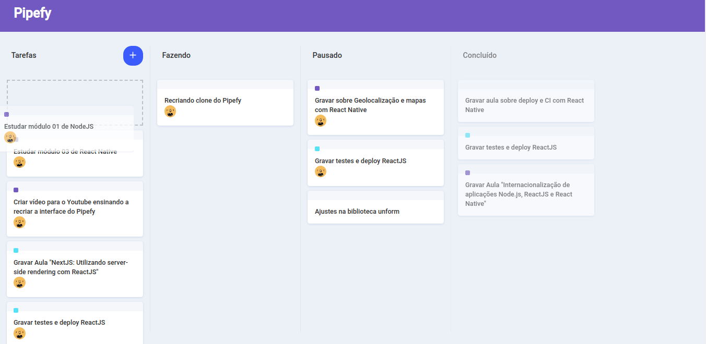

# Rocketfy

It is a clone of the Pipefy application using React and applying concepts of Drag n Drop.

## Built With

- [ReactJS](https://reactjs.org/)
- [styled-components](https://www.styled-components.com/)
- [react-icons](https://react-icons.netlify.com/)
- [react-dnd](https://github.com/react-dnd/react-dnd)
- [react-dnd-html5-backend](https://github.com/react-dnd/react-dnd-html5-backend)
- [Immer](https://github.com/immerjs/immer)
- [VSCode](https://code.visualstudio.com/)

## Getting Started

These instructions will get you a copy of the project up and running on your local machine for development and testing purposes. To clone and run this application, you'll need Git, Node.js v10.16 or higher + Yarn v1.13 or higher installed on your computer.

### Installing

    # Clone this repository

    $ git clone https://github.com/saaddalida/pipefy-clone.git

    # Go into the repository

    $ cd pipefy-clone

    # Install dependencies

    $ yarn install

    # Run the app 

    $ yarn start

## Authors

- **Dalida Saad** - [Twitter](https://twitter.com/dalida_saad)

## License

This project is licensed under the MIT License.
